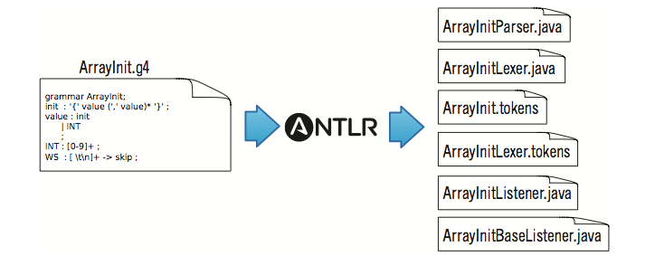
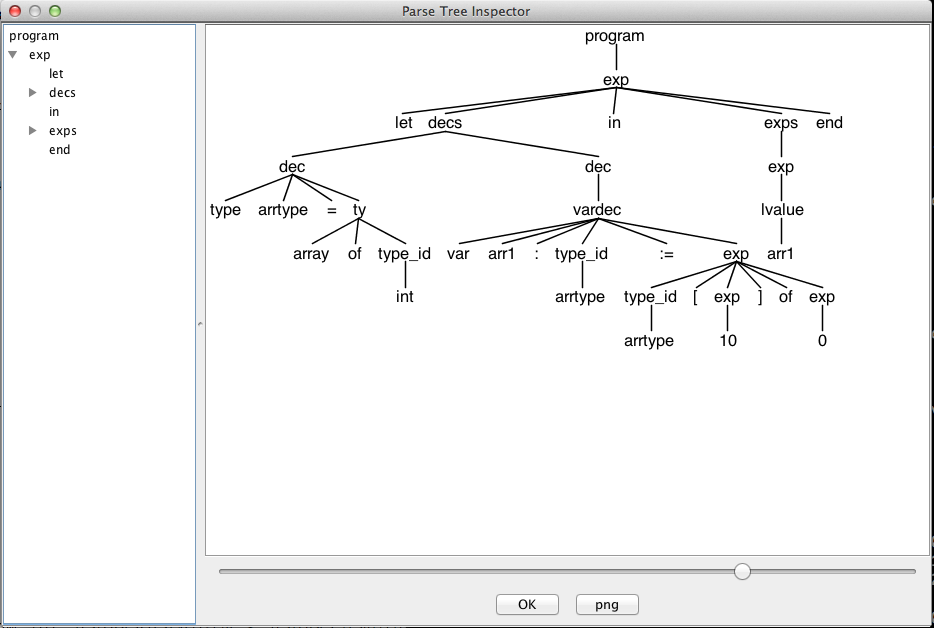
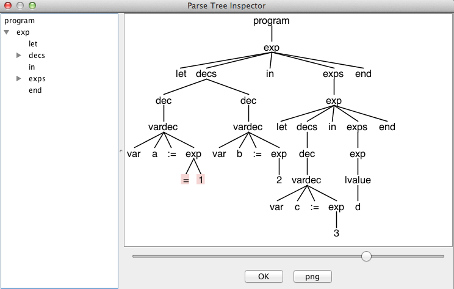

#
编译原理Tiger编译器前端报告

陈炜栋 11300240057

董家明 11300240025

#目录

* 一 项目要求及完成情况
* 二 项目总览
* 三 ANTLR简述
* 四 AST的生成
* 五 AST测试
* 六 变量作用域检查
* 七 变量声明测试
* 八 基本的类型检查
* 九 基本的类型检查测试

## 一 项目要求及完成情况
1. 正确的词法/语法分析，给出对应的文法文件2分 √  (`Tiger.g4`)
2. 输出正确的抽象语法树	5分 √   (`testcases中50个测试文件,testcase-result中对应的抽象语法树`)
3. 错误处理功能
	1. 提示错误类型（词法错误、语法错误、语义错误等）、出错位置等 5分 √  （`词法错误，语法错误ANTLR默认行为,部分语义错误：变量作用域及基本类型检查`）
	2. 错误修复  3分  √  (`ANTLR默认行为 single-token insertion and single-token deletion`)
4. 发挥想象力，使编译器尽善尽美 5分 √ (`实现了变量作用域检查和基本类型检查`)
5. Project文档
    1. 使用语法（文法类型，有无改动语法、如何改动等），错误处理说明等 5分 √ （`对实现的变量作用变量作用域检查和基本类型检查的错误处理代码进行了介绍`）
	2. 对本项目语法的使用工具的体会 5分 √  (`ANTLR简述部分`)

	
##  二 项目总览
使用ANTLR工具,为Tiger构造一个编译器前端，将输入的Tigger语言转化为抽象语法树，实现了变量作用域检查和简单的Type Checking。

## 三 ANTLR简述
[ANTLR](www.antlr.org)(ANother Tool for language Recognition).作者Terence Parr(University of San Francisco).
ANTLR是一个可以接受含有语法描述的语言描述符并且生成程序能够识别这些语言所产生的句子。作为一个翻译程序的 一部分，你可以给你的语法附上简单的操作符和行为并且告诉ANTLR如何构造AST并且如何输出它们。ANTLR知道如何使用Java，C++，C#或者Python来生成它们。
注意到`词法错误和语法错误`ANTLR有默认的处理行为
<pre>
Here is how ANTLR uses those ideas together in a nutshell: parsers perform <b>single-token insertion</b> and <b>single-token deletion</b> upon mismatched token errors if possible. If not, parsers gobble up tokens until they find a token that could reasonably follow the current rule and then return, continuing as if nothing had happened. 
</pre>
 

 

如上图所示，把源文件转化成AST，需要一个Lexer和Parser。Lexer把源文件读入，分成一个个token。然后Parser读入Lexer产生的token生成AST。在ANTLR提供了Lisenter和Visitor两种方式来遍历抽象语法树。`本项目利用这些接口来实现变量声明检查。和基本的类型检查`。

 

## 四 AST的生成

ANTLR是一个比较成熟的工具，[The Definitive ANTLR 4 Reference](http://pragprog.com/book/tpantlr2/the-definitive-antlr-4-reference) 详细介绍了工具的使用说明。为了生成AST，需要完成grammer定义文件Tiger.g4 下面定义的语法，基本与[官方语法文档](https://www.lrde.epita.fr/~akim/ccmp/tiger.html)指定的语法相同。 为了简化之后的Type Checking，把Ojbect相关的new class等语法去掉了。

	java  org.antlr.v4.Tool Tiger.g4
然后会产生`TigerLexer.java`, `TigerParser.java`, Tiger.tokens , TiegerLexder.tokens, `TigerListener.java` `TigerBaseLisetener.java` 

其中TigerLexer.java是ANTLR根据g4为我生成的Lexer，TigerParser.java是对应的Parser，TigerListener.java是前面提到的Listener方式的抽象语法树的接口，TigerBaseListener.java是这个接口的一个基本实现。我们的实现通过继承TigerBaseListener来重载中间的放来实现期望的行为。

	java org.antlr.v4.runtime.misc.TestRig Tiger program -tree test.in  # 输出文本信息
	java org.antlr.v4.runtime.misc.TestRig Tiger program -gui test.in   # 生成图形

####TigerLexer.java节选
<pre>
  1 // Generated from Tiger.g4 by ANTLR 4.2.1
  2 import org.antlr.v4.runtime.Lexer;
  3 import org.antlr.v4.runtime.CharStream;
  4 import org.antlr.v4.runtime.Token;
  5 import org.antlr.v4.runtime.TokenStream;
  6 import org.antlr.v4.runtime.*;
  7 import org.antlr.v4.runtime.atn.*;
  8 import org.antlr.v4.runtime.dfa.DFA;
  9 import org.antlr.v4.runtime.misc.*;
 10
 11 @SuppressWarnings({"all", "warnings", "unchecked", "unused", "cast"})
 12 public class TigerLexer extends Lexer {
 13     protected static final DFA[] _decisionToDFA;
 14     protected static final PredictionContextCache _sharedContextCache =
 15         new PredictionContextCache();
 16     public static final int
 17         T__39=1, T__38=2, T__37=3, T__36=4, T__35=5, T__34=6, T__33=7, T__32=8,
 18         T__31=9, T__30=10, T__29=11, T__28=12, T__27=13, T__26=14, T__25=15, T__24=16,
 19         T__23=17, T__22=18, T__21=19, T__20=20, T__19=21, T__18=22, T__17=23,
 20         T__16=24, T__15=25, T__14=26, T__13=27, T__12=28, T__11=29, T__10=30,
 21         T__9=31, T__8=32, T__7=33, T__6=34, T__5=35, T__4=36, T__3=37, T__2=38,
 22         T__1=39, T__0=40, INTEGER=41, STRING=42, ID=43, COMMENT=44, LINE_COMMENT=45,
 23         WS=46;
 24     public static String[] modeNames = {
 25         "DEFAULT_MODE"
 26     };
 etc ...
</pre>

####TigerParser.java节选
<pre>
   1 // Generated from Tiger.g4 by ANTLR 4.2.1
   2 import org.antlr.v4.runtime.atn.*;
   3 import org.antlr.v4.runtime.dfa.DFA;
   4 import org.antlr.v4.runtime.*;
   5 import org.antlr.v4.runtime.misc.*;
   6 import org.antlr.v4.runtime.tree.*;
   7 import java.util.List;
   8 import java.util.Iterator;
   9 import java.util.ArrayList;
  10
  11 @SuppressWarnings({"all", "warnings", "unchecked", "unused", "cast"})
  12 public class TigerParser extends Parser {
  13     protected static final DFA[] _decisionToDFA;
  14     protected static final PredictionContextCache _sharedContextCache =
  15         new PredictionContextCache();
  16     public static final int
  17         T__39=1, T__38=2, T__37=3, T__36=4, T__35=5, T__34=6, T__33=7, T__32=8,
  18         T__31=9, T__30=10, T__29=11, T__28=12, T__27=13, T__26=14, T__25=15, T__24=16,
  19         T__23=17, T__22=18, T__21=19, T__20=20, T__19=21, T__18=22, T__17=23,
  20         T__16=24, T__15=25, T__14=26, T__13=27, T__12=28, T__11=29, T__10=30,
  21         T__9=31, T__8=32, T__7=33, T__6=34, T__5=35, T__4=36, T__3=37, T__2=38,
  22         T__1=39, T__0=40, INTEGER=41, STRING=42, ID=43, COMMENT=44, LINE_COMMENT=45,
  23         WS=46;
  24     public static final String[] tokenNames = {
  25         "<INVALID>", "']'", "'&'", "'in'", "'of'", "','", "'['", "'-'", "'*'",
  26         "'while'", "'('", "':'", "'<'", "'<='", "'var'", "'array'", "'nil'", "'to'",
  27         "'{'", "'break'", "'let'", "'else'", "'}'", "'do'", "')'", "'function'",
  28         "'.'", "'+'", "'for'", "'<>'", "'='", "';'", "'if '", "'>'", "'type'",
  29         "':='", "'then'", "'/'", "'>='", "'|'", "'end'", "INTEGER", "STRING",
  30         "ID", "COMMENT", "LINE_COMMENT", "WS"
  31     };
  etc ...
</pre>
####Tiger.g4语法文件
<pre>
/**
   May,28 2014 
   author: whimsycwd
   compiler project
*/

grammar Tiger;

program :  exp                                                      
        | decs                                                      
        ;

exp : 'nil'                                                         #Nil
     | INTEGER                                                      #Integer
     | STRING                                                       #String
     | type_id '[' exp ']' 'of' exp                                 #Array
     | type_id '{' ( ID '=' exp (',' ID '=' exp )* )? '}'           #Record
     //| 'new' type_id                                                #New                                                
     | lvalue                                                       #LeftValue
     | ID '(' ( exp (',' exp)*)? ')'                                    #Call
     | '-' exp                                                          #UnaryMinus
     | exp ('*' | '/') exp                                          #Mul
     | exp ('+' | '-') exp                                          #Add
     | exp ('<>' | '=' | '>=' | '<=' | '>' | '<') exp               #Cmp
     | exp ('&' | '|') exp                                          #Logical
     | '(' exps ')'                                                 #ParenExprs
     | lvalue ':=' exp                                              #Assign
     | 'if ' exp 'then' exp ('else' exp)?                           #IfStmt
     | 'while' exp 'do' exp                                         #WhileStmt
     | 'for' ID ':=' exp 'to' exp 'do' exp                              #ForStmt
     | 'break'                                                          #Break
     | 'let' decs 'in' exps 'end'                                       #LET
     ;

exps : ( exp (';' exp)* )?;                                        

decs : dec*;                                                       

dec : 'type' ID '=' ty                                                  #TypeDec
    | vardec                                                            #VarDecNothing
    | 'function' ID '(' tyfields? ')' (':' type_id)? '=' exp            #FuncDec
    //| 'primitive' ID '(' tyfields? ')' (':' type_id)?                   
    //| 'import' STRING
    //| 'class' ID ('extends' type_id)? '{' classfields '}'
    ;

vardec : 'var' ID (':' type_id)? ':=' exp                               #VarDecInner
        ;
//classfields : classfield*
//        ;

//classfield : vardec
//          | 'method' ID '(' tyfields ')' (':' type_id) '=' exp
//           ;

ty : type_id
   | '{' tyfields? '}'
   | 'array' 'of' type_id
//   | 'class' ('extends' type_id)? '{' classfields '}'
   ;
tyfields : ( ID ':' type_id (',' ID ':' type_id)*)
    ;

type_id : ID
    ;
lvalue  : ID                            #SimpleVar
        | lvalue '.' ID                 #DotVar
        | lvalue '[' exp ']'            #BracketVar
        ;

INTEGER :   DIGIT+;

STRING : '"' (ESC | .)*? '"';
ID : LETTER (LETTER | DIGIT) *;

fragment
ESC : '\\' [btnr"\\];

fragment
LETTER : [a-zA-Z] | '_';

fragment 
DIGIT : [0-9];

COMMENT : '/*' .*? '*/'  ->skip;
LINE_COMMENT : '//' .*? '\n' ->skip;

WS : [ \n\r\t]+ ->skip;

</pre>

## 五 AST测试
### 配置测试环境 config.profile
<pre>
  1 BASE="/Users/whimsycwd/Repo/ANTLR/Tiger/"
  2
  3 export CLASSPATH=".:./lib/antlr-4.2.1-complete.jar:${BASE}lib/antlr-4.2.1-complete.jar:${BASE}classes"
  4
  5 alias antlr4='java  org.antlr.v4.Tool'
  6 alias grun='java org.antlr.v4.runtime.misc.TestRig'
  7 alias runTiger='grun Tiger program'
</pre>
上述代码为Terminal配置了环境变量。只需改变BASE到实际的地址。在Terminal中source config.profile，就可以使用antlr4,grun,runTiger的指令的简称。

### 下载测试代码 fetch.sh
<pre>
  1 URL=http://www.computing.dcu.ie/~hamilton/teaching/CA448/testcases/
  2
  3 rm *.tig
  4
  5 for i in {1..49}
  6 do
  7     curl -O  "${URL}test${i}.tig"
  8
  9 done
 10
 11 for name in 'queens.tig' 'merge.tig'
 12 do
 13      curl -O "${URL}$name"
 14 done
</pre>
新建文件夹testcases, 在该目录下执行上述的代码可以将测试文件批量下载下来。

### 编译运行 run.sh
<pre>
  1 # clean the generated file and recompile
  2 # May 31,2014  whimsycwd
  3
  4
  5 #source config.profile
  6
  7 rm Tiger*.java 2>/dev/null
  8 #rm Tiger*.class 2>/dev/null
  9 rm Tiger*.tokens 2>/dev/null
 10 rm ./classes/* 2>/dev/null
 11
 12 echo "File deleted"
 13
 14 echo "ANTLR Generating"
 15 java  org.antlr.v4.Tool Tiger.g4
 16
 17 echo "Compile Start"
 18
 19 #javac  Tiger*.java -d ./classes/
 20 javac *.java -d ./classes/
</pre>

### 输出测试AST结果 runAllTest.sh
<pre>
  1 # RUN ALL TEST
  2 # May 31, 2014 whimsycwd
  3
  4
  5 echo "deleting testcases-result"
  6 rm testcases-result/*
  7
  8 for i in {1..49}
  9 do
 10     echo "test${i}.tig is processing"
 11     java org.antlr.v4.runtime.misc.TestRig Tiger program -tree "testcases/test${i}.tig" > "testcases-result/test${i}.tig.res"
 12 done
 13
 14 for name in 'queens.tig' 'merge.tig'
 15 do
 16     echo "${name} is processing"
 17     java org.antlr.v4.runtime.misc.TestRig Tiger program -tree "testcases/${name}" > "testcases-result/${name}.res"
 18 done
</pre>
新建testcases-result
利用上述代码能够批量输出测试代码到testcases-result/

###结果示例 1 testcases/test1.tig
<pre>
  1 /* an array type and an array variable */
  2 let
  3     type  arrtype = array of int
  4     var arr1:arrtype := arrtype [10] of 0
  5 in
  6     arr1
  7 end
</pre>
代码输出了AST结果文件：
testcases-result/test.tig.res
<pre>
(program (exp let (decs (dec type arrtype = (ty array of (type_id int))) (dec (vardec var arr1 : (type_id arrtype) := (exp (type_id arrtype) [ (exp 10) ] of (exp 0))))) in (exps (exp (lvalue arr1))) end))
</pre>
对应的图形化的结果为：

###结果示例 2 mytest/error.in `错误提示和行号`
<pre>
  1 let
  2     var a:== 1
  3     var b:= 2
  4 in
  5     let
  6         var c := 3
  7     in
  8         d
  9     end
 10 end
</pre>
代码输出结果
<pre>
whimsyMini:Tiger whimsycwd$ runTiger -tree error.in
line 2:11 no viable alternative at input '='
(program (exp let (decs (dec (vardec var a := (exp = 1))) (dec (vardec var b := (exp 2)))) in (exps (exp let (decs (dec (vardec var c := (exp 3)))) in (exps (exp (lvalue d))) end)) end))
</pre>
对应的图形化的结果,追到错误的地方，被高亮出来了，并且跳过继续解析。

## 六 变量作用域检查
为了实现变量声明的检查，两次遍历抽象语法树，第一次遍历抽象语法树，简历变量表，注意在遍历的过程中，还要考虑作用域，进入一个作用域的时候需要创建新的作用域。作用域构成一个链表，resolve一个变量的时候需要跟往上层去查找。

##### CheckSymbols.java
<pre>
...
 27     public void process(String[] args) throws Exception {
 28         String inputFile = null;
 29         if ( args.length>0 ) inputFile = args[0];
 30         InputStream is = System.in;
 31         if ( inputFile!=null ) {
 32             is = new FileInputStream(inputFile);
 33         }
 34         ANTLRInputStream input = new ANTLRInputStream(is);
 35         TigerLexer lexer = new TigerLexer(input);
 36         CommonTokenStream tokens = new CommonTokenStream(lexer);
 37         TigerParser parser = new TigerParser(tokens);
 38         parser.setBuildParseTree(true);
 39         ParseTree tree = parser.program();
 40         // show tree in text form
 41 //        System.out.println(tree.toStringTree(parser));
 42
 43         ParseTreeWalker walker = new ParseTreeWalker();
 44         DefPhase def = new DefPhase();
 45         walker.walk(def, tree);
 46         // create next phase and feed symbol table info from def to ref phase
 47         RefPhase ref = new RefPhase(def.globals, def.scopes);
 48         walker.walk(ref, tree);
 49         //TypePhase type = new TypePhase();
 50         //walker.walk(type, tree);
 51    }
 ...
</pre>
 

具体的代码 `CheckSymbols.java` `DefPhase.java` `Scope.java` `BaseScope.java` `GlobalScope.java` `LocalScope.java` `RefPhase.java`

第一阶段DefPhase,如下所示，比如在进入Function的时候`currentScope = new LocalScope(currentScope);` 新建一个作用域。在退出Function的时候 `currentScope = currentScope.getEnclosingScope();`  往链表上层去找。

##### DefPhase.java
<pre>
 ...
 44     public void enterFuncDec(TigerParser.FuncDecContext ctx){
 45         // formal parameter
 46         //if (debug)
 47         //    System.out.println("Entering FuncDec "+ currentScope);
 48         currentScope = new LocalScope(currentScope);
 49
 50         TigerParser.TyfieldsContext tyfields = ctx.tyfields();
 51         if (tyfields != null){
 52             // if there is formal parameters.
 53             List<TerminalNode> list = tyfields.ID();
 54             for (TerminalNode e : list){
 55                 currentScope.define(new VariableSymbol( e.getSymbol().getText() ) );  // 把变量添加到当前作用域
 56             }
 57         }
 58         saveScope(ctx, currentScope);
 59     }
 60     public void exitFuncDec(TigerParser.FuncDecContext ctx){
 61
 62         //if (debug)
 63         //System.out.println("Exiting FuncDec "+ currentScope);
 64         //System.out.println(currentScope);
 65         currentScope = currentScope.getEnclosingScope();   // 退出作用域
 66     }
 ...
</pre>

检查变量varName是否在存在。解析变量代码如下。
#####BaseScope.java
<pre>
 10     public Symbol resolve(String name) {
 11         Symbol s = symbols.get(name);
 12         if ( s!=null ) return s;
 13         // if not here, check any enclosing scope
 14         if ( enclosingScope != null ) return enclosingScope.resolve(name);
 15         return null; // not found
 16     }
</pre>
在第二阶段RefPhase当变量解析不到该变量，输出该类型的错误。
####RefPhase.java
<pre>
...
212     public void exitSimpleVar(TigerParser.SimpleVarContext ctx){
213
214         String name = ctx.ID().getSymbol().getText();
215
216         Symbol var = currentScope.resolve(name);
217        // print(currentScope);
218         if (var == null){
219             CheckSymbols.error(ctx.ID().getSymbol(),"no such variable: " + name);
220         }
...
</pre>

## 七 变量声明测试

###结果示例  mytest/test.in
<pre>
  1 let
  2     var a:= 1
  3     var b:= 2
  4 in
  5     let
  6         var c := 3
  7     in
  8         d
  9     end
 10 end
</pre>
注意到这个代码中 d并找不到此变量。可得到输出结果
<pre>
whimsyMini:Tiger whimsycwd$ java CheckSymbols mytest/test.in
line 8:8 no such variable: d
</pre>

## 八 基本的类型检查

为了实现基本的类型检查，对于每一个抽象语法树上的节点都需要给他一个类型。定义了一个AST节点到Type的映射typeSys.

	'for' ID ':=' exp 'to' exp 'do' exp
下面的代检查了三个exp的类型。 exp1 和 exp2必须是Type.tInt。而对于整个语句的类型定义为exp3.
	

####RefPhase.java
<pre>
...
170         Type t1 = typeSys.get(ctx.exp(0));
171         Type t2 = typeSys.get(ctx.exp(1));
172
173         if (t1 != Type.tInt){
174             CheckSymbols.error( ctx.getStart(), "loop pd expression must be tInt" );
175             typeSys.put(ctx, Type.tVoid);
176         } else {
177             typeSys.put(ctx, t2);
178         }
179         print("In WhileStmt : " + typeSys.get(ctx) );
180     }
181
182     public void exitForStmt(TigerParser.ForStmtContext ctx){
183         Type t1 = typeSys.get(ctx.exp(0));
184         Type t2 = typeSys.get(ctx.exp(1));
185         Type t3 = typeSys.get(ctx.exp(2));
186
187         if (t1 != Type.tInt || t2 != Type.tInt){
188             CheckSymbols.error( ctx.getStart(), "loop start and end must both be tInt" );
189             typeSys.put(ctx, Type.tVoid);
190         } else {
191             typeSys.put(ctx, t3);
192         }
193         print("In ForStmt " + typeSys.get(ctx));
194         currentScope = currentScope.getEnclosingScope();
195     }
196
197     public void exitLET(TigerParser.LETContext ctx){
198         typeSys.put(ctx, typeSys.get( ctx.exps() ) );
199         currentScope = currentScope.getEnclosingScope(); // exit a scope
200         print("In LET: "+typeSys.get(ctx) );
201     }
202     public void exitExps(TigerParser.ExpsContext ctx){
203         List<TigerParser.ExpContext> list = ctx.exp();
204         typeSys.put(ctx, typeSys.get( list.get(list.size() -1 ) ) );
205         print("In exps: "+  typeSys.get(ctx) );
206
207     }
...
</pre>

## 九 基本的类型检查测试

###结果示例  mytest/add.in
<pre>
  1 let
  2     var a := nil
  3     var b := 12
  4     var c := "adfaf"
  5     var d := 133
  6 in
  7     -c;
  8     -b;
  9     b+d;
 10     b-d;
 11     a+c;
 12     b/d;
 13     b*d;
 14     b*(d+b);
 15     d := b+d
 16
 17 end
</pre>
这个代码的输出结果，发现了其类型的错误。注意到line 7 -c,其中c是一个String错误。line 11 a + c, 只有Int有定义 加法。
<pre>
whimsyMini:mytest whimsycwd$ java CheckSymbols add.in
line 7:4 Expected - Int, got - tString
line 11:4 Expected Int +/- Int got tVoid +/- tString
</pre>

